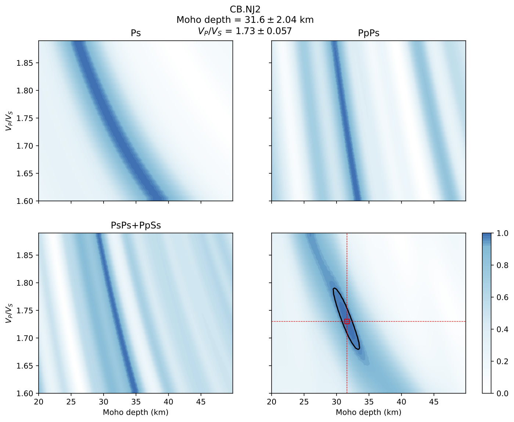

# Calculate PRFs of the station CB.NJ2

Here, we provide an example for calculating PRFs of CB.NJ2, which is a permanent station at Nanjing China mainland.

## Download this example

Download link: [ex-prf.tar.gz](https://osf.io/dxcfz/download)

unzip the file to any directory.

```shell
tar -xzf Data.CB.NJ2.tar.gz
```

the package include the seismic records of the station CB.NJ2 and configure files for RF calculation and H-k stacking.

The seismic records of CB.NJ2 were cut out from origin time of seismic events to 1000 s after the origin time, which contained the direct P wave and its conversion phases.

## Run this example

Change directory to Data.CB.NJ2 then execute following command:

```shell
prf rf.cfg
```

As the `rfpath` set in the `rf.cfg`, run following command to virtual check PRFs use a GUI. See [Virtual check PRFs with an user interface](../usage/pickrf.md) in detail.

```shell
pickrf ./RFresult/CB.NJ2
```

# Estimate the Moho depth and the crustal Vp/Vs using the H-k stacking method

The PRFs had been saved to `./RFresult/CB.NJ2`, and the `CB.NJ2finallist.dat` had been created via the virtual check. The Moho depth can be estimated using the the H-k stacking method.

The Seispy has provided a command `hk` to do this process.

```shell
usage: hk [-h] [-v] cfg_file

HK stacking for single station

positional arguments:
  cfg_file    Path to HK configure file

optional arguments:
  -h, --help  show this help message and exit
  -v          Display results to standard output
```

## Prepare a configure file for `hk`

Here we provide an `hk.cfg` in this example. See [Templates of configurations](../notes/config.rst) in detail.

## Run this example

```shell
hk hk.cfg -p
```

If `-p` was specified a figure would be generated to `hkpath`, which shows the stacking energy of difference phases and the final result of the estimation.



The result of the Moho depth and Vp/Vs were saved into the path of `hklst`(default is `hk.dat`).